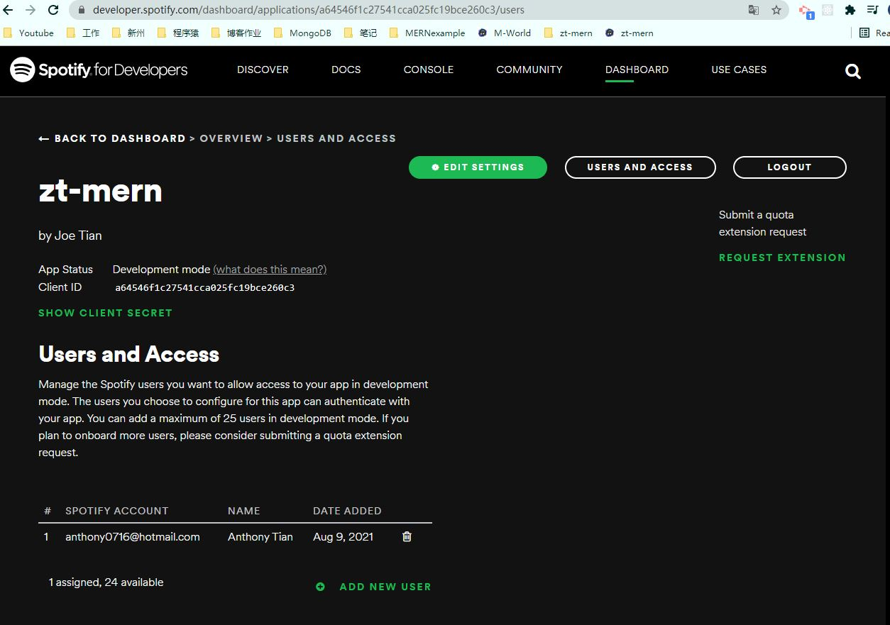
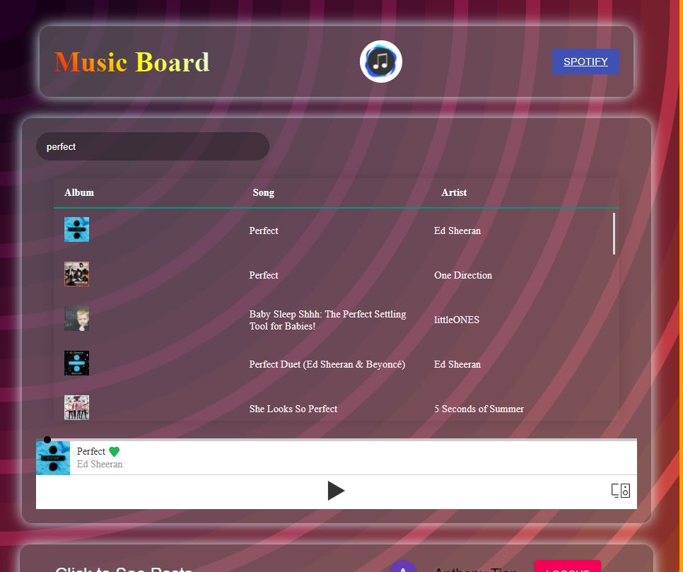
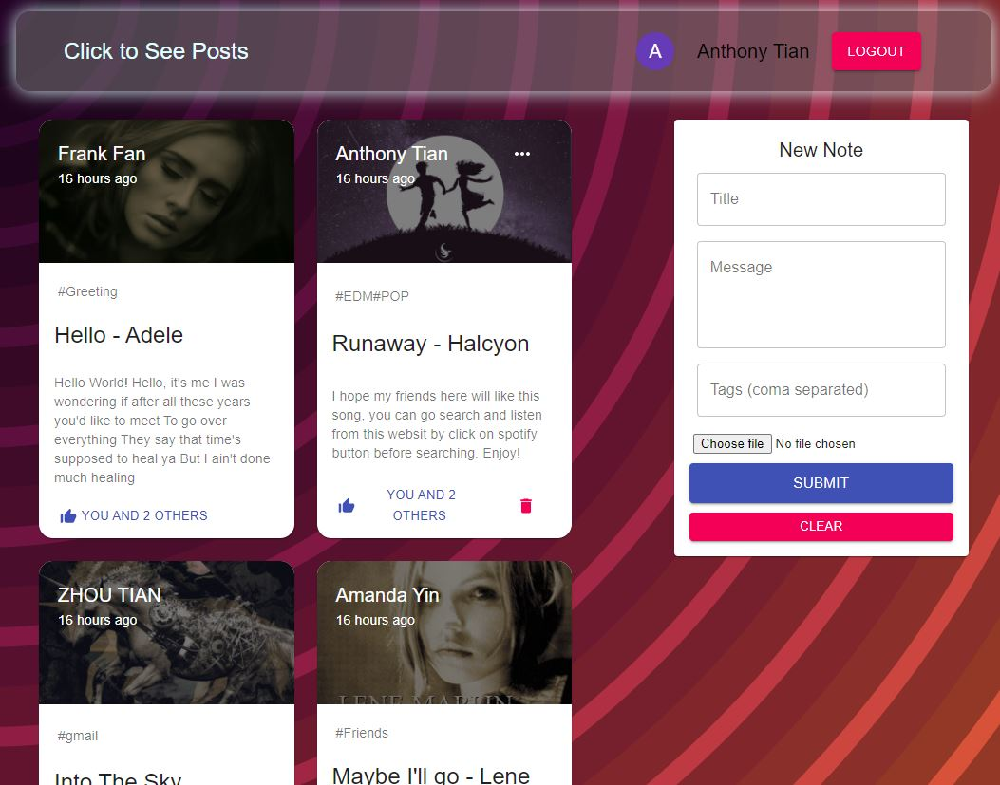

# zt-mern
  
  ## Description
   This is a MERN Stack project integrated with Spotify API. Allowing Users to search and listen live stream music by using their Spotify Account ( Note: Spotify Web playback function only supports premium class users. Won't work with free accounts ). Features include:
* Music Searching & Playing.
* live stream music playback.
* Creating, Reading, Updating, Deleting music posts.
* Liking each posts once only for every user.

## Technics
  See the listed technics applied with this project.
* Integrating with third party API.
* MERN Stack.
* JWT Authentication.
* Gmail Authentication.
* MERN Stack.
* Redux.

## Guides ( Important! )
 Because currently the playback feature is dependent on a spotify developer account with a uni client secret, your spotify account needs to be added as one of the 25 testing account first. Please send me ( 0406199376 ) your User Name and Email, I don't need your password and I will add your account to get the playback feature of this MERN application.
 * Your Spotify User Name
 * Your Spotify Email
 

  
## Links

* The URL of the deployed application

    https://zt-mern.herokuapp.com/

* The URL of the GitHub repository.
    
    https://github.com/ZhouTian0716/zt-mern

## Demonstration Snapshoots
The following image shows the web application's appearance and functionality:

1.Demo

2.Player Section

3.Posts Section

## Future Development
* Research on Spotify Web API.
* Pagination for Card elements.
* Frontend Updates.
* Comments, Sharing, moving to a fully functioning social network.
